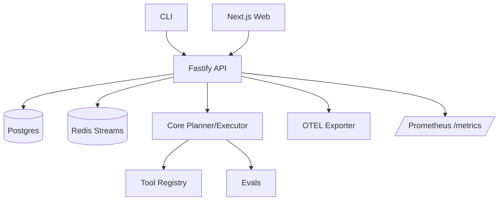

# agentops-autopilot
> Autonomous repo autopilot for plan → execute → validate → PR with full traceability.


## What it does
AgentOps Autopilot takes a repo task, generates a plan, runs the steps (lint/tests/build), captures logs/traces/metrics, and prepares a PR-ready summary with artifacts and timelines.

## Who it’s for
- Backend/API engineers who want reproducible fix/feature pipelines
- Frontend engineers needing transparent task timelines
- DevEx/SRE teams enforcing standards (lint/test/build/metrics)
- Automation/AI teams prototyping autonomous repo agents

## Features
- Planner + executor with safe-shell tool registry (git/gh/http/fs stubs) and redaction
- Fastify API with REST, health, `/metrics`, OTEL spans, and pino JSON logs
- Next.js web timeline (demo) that checks API health and shows task events
- CLI to plan/run/demo tasks and write artifacts to `examples/output`
- Evals harness with golden tasks to validate the pipeline path
- Dockerized API/Web + Postgres + Redis via `docker-compose`
- Makefile targets for setup/lint/test/demo/doctor for 2–5 minute time-to-wow
- Semantic-release + conventional commits + changesets + commitlint
- CI: lint, typecheck, test, build, docker build, SBOM, CodeQL

## Quickstart
```bash
# 1) Install deps
make setup

# 2) Prepare env
cp .env.example .env

# 3) Smoke check
make demo    # writes examples/output/demo-run.json

# 4) Run API + Web (dev)
pnpm --filter @agentops-autopilot/api dev &
pnpm --filter @agentops-autopilot/web dev &
```

## Example output / screenshots
- Demo artifact: [`examples/output/demo-run.json`](examples/output/demo-run.json)
- Web timeline (dev): shows API health + demo events at http://localhost:3000

## How it works

- CLI/Web/HTTP submit tasks to the Fastify API.
- API enqueues work (Redis fallback in-memory) and stores metadata (Postgres optional in demo).
- Core planner builds steps; executor runs via tool registry with safe-shell guard.
- Events/logs/spans flow to metrics (/metrics), OTEL exporter, and pino logs.
- Artifacts and summaries are returned and saved to `examples/output/`.

See [docs/ARCHITECTURE.md](docs/ARCHITECTURE.md) for full details.

## Configuration
All via env vars (see [.env.example](.env.example) and [docs/CONFIG.md](docs/CONFIG.md)):
- Core: `NODE_ENV`, `LOG_LEVEL`
- API: `API_PORT`, `API_HOST`, `AUTH_TOKEN`, `POSTGRES_URL`, `REDIS_URL`, `OTEL_SERVICE_NAME`, `OTEL_EXPORTER_OTLP_ENDPOINT`
- Web: `WEB_PORT`, `NEXT_PUBLIC_API_BASE_URL`
- CLI: `GITHUB_TOKEN` (optional for PR simulation)
- Docker compose overrides for services

## Troubleshooting
- Missing deps: run `make doctor` (checks Node 20, pnpm, docker, .env, install).
- API can’t reach Postgres/Redis: starts anyway with warnings and in-memory fallbacks.
- Ports busy: change `API_PORT`/`WEB_PORT`/compose mappings.
- Lint/test failures: ensure `make setup` ran and rerun `pnpm lint` / `pnpm test --filter <pkg>`.

## Contributing
See [CONTRIBUTING.md](CONTRIBUTING.md). Conventional commits enforced; use changesets for versioned changes.

## Security
Secrets only via env; logs redact tokens/URLs. Auth required on mutating API routes (`Authorization: Bearer <AUTH_TOKEN>`). Report issues per [SECURITY.md](SECURITY.md).

## License
[MIT](LICENSE)
