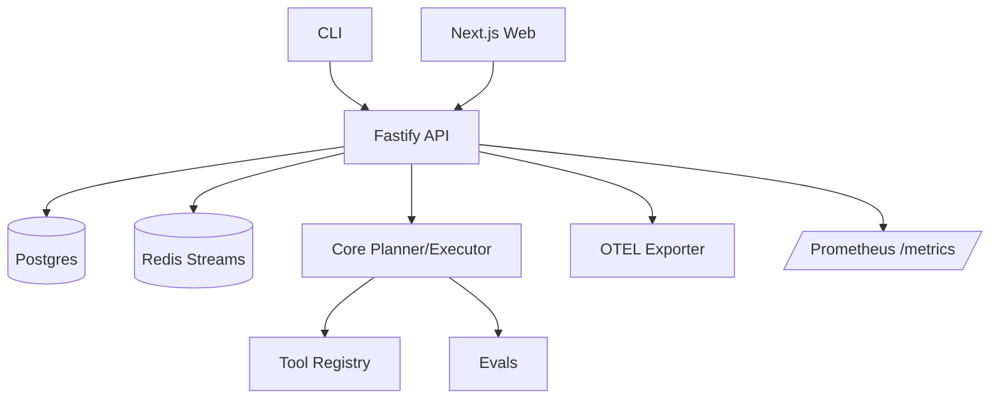

# Architecture

## Components
- **Core**: Planner, executor, policy and memory interfaces, event bus.
- **Tools**: Minimal tool registry (git/gh/filesystem/safe-shell/http) with tracing hooks.
- **API**: Fastify server exposing REST/WebSocket, task runner, auth, metrics, OTEL traces, pino logs.
- **Web**: Next.js UI for task timeline and artifacts.
- **CLI**: Commands to plan, run, and simulate PRs.
- **Evals**: Golden tasks and scorer to validate pipelines.
- **Data stores**: Postgres for state, Redis for queues/streams (in-memory fallback for dev).
- **Observability**: OpenTelemetry spans, pino JSON logs, Prometheus metrics endpoint.

## Data Flow
1. CLI or Web posts a task to the API.
2. API enqueues the task (Redis) and persists metadata (Postgres).
3. Worker executes planner → executor → tools; emits events.
4. Events are stored and streamed to Web/CLI; artifacts saved to disk.
5. Logs and traces emitted via pino + OTEL; metrics exposed at `/metrics`.

See `docs/runbook.md` for operational steps and `docs/config.md` for configuration.
